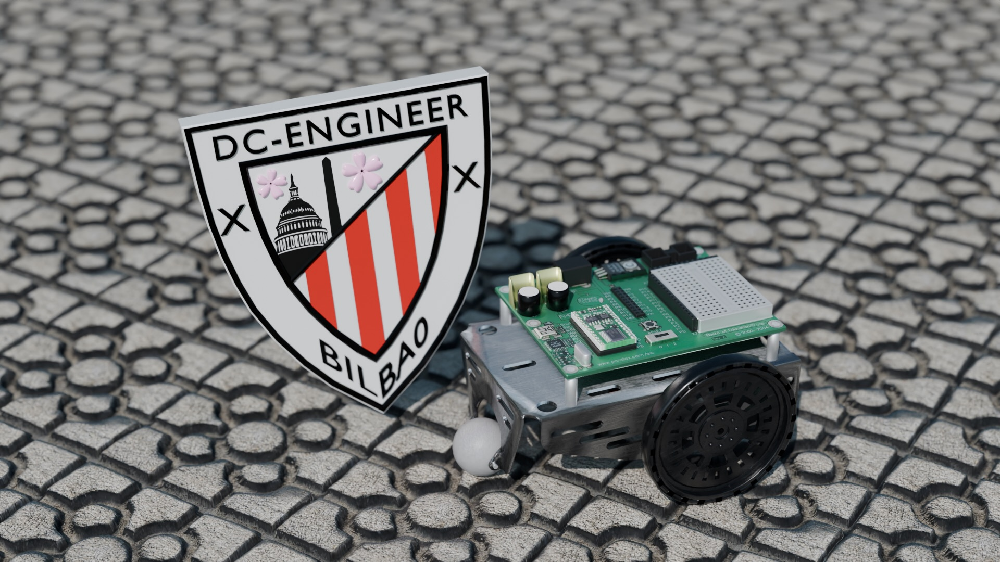
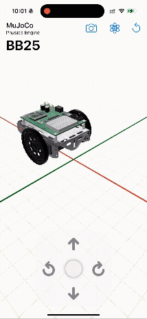
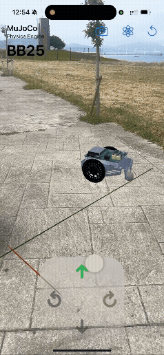

# BB25
This repository contains a proof-of-concept demonstration for the simulation and control of a differential drive robot in augmented reality (AR).
The specific robot model is a [Board of Education (BoE) Bot](https://www.parallax.com/boe-bot-robot/), frequently used in mechatronics engineering education, with the name "BB25" representing that this is a BoE Bot simulated in the year 2025.
RealityKit and SwiftUI are used to generate the iOS-native visualization, with [MuJoCo](https://github.com/google-deepmind/mujoco) providing a high-fidelity multibody dynamics simulation engine.

## Blender Modeling

I created the 3D model of the BoE Bot from scratch using Blender, using diagrams and reference images from the Parallax website.
My intent was to create a near-photorealistic representation of the robot, to demonstrate the unique capabilities of a modern AR-rendering engine compared to traditional robotics simulation code.

## Augmented Reality

Various export formats are used to produce the simulation and visualization models for AR.
The MuJoCo code imports separate parts for the chassis and wheels in STL format, which are used to define the collision meshes.
RealityKit imports files in USDZ format for these same parts, which retains both the mesh as well as the Physics Based Material (PBR) textures.
The app is able to toggle between using the native RealityKit physics engine, which operates directly on the USDZ files give user-specified mass and collision properties, and a separete MuJoCo based physics engine, which simulates in the background and provides transform updates to the UI at each frame.

| Virtual | Spatial |
|---|---|
|  |  |
